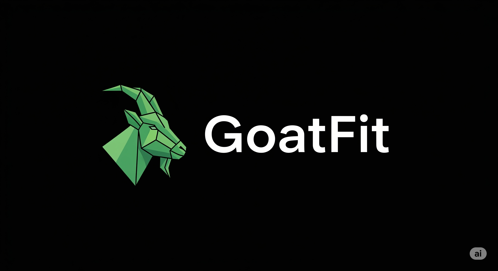

# 🏥 GoatFit - Your Personal Health Guardian

<p align="center">
  
</p>

<p align="center">
  <strong>A 24/7 health monitoring system that connects to your smartwatch via Google Fit, automatically detects dangerous vital signs, and instantly alerts your family network.</strong>
</p>

<p align="center">
    
    
    
</p>

---

GoatFit is your personal health guardian. It securely links to your Google Fit account, providing continuous, automated monitoring of your vital signs. If a potentially dangerous health pattern is detected, it instantly sends detailed emergency alerts to your designated family and friends. The system is built with a persistent database, ensuring that monitoring continues 24/7, even if the server restarts.

## ✨ Key Features

- **⌚ Real-time Vital Monitoring**: Securely syncs heart rate, sleep, steps, and calories directly from your Google Fit data.
- **🚨 24/7 Persistent Health Checks**: Runs continuously in the background, checking your vitals every minute. Monitoring state is stored in the database and resumes on startup.
- **🧠 Intelligent Alert System**: Uses user-customizable thresholds (e.g., high/low heart rate) to detect and classify health risks (Warning vs. Critical).
- **🤖 Gemini AI Integration (Optional)**: Leverages Google's Gemini AI to provide deeper analysis of health patterns when an alert is triggered.
- **👨‍👩‍👧‍👦 Emergency Contact Network**: Users can register and manage a list of family and friends who will receive instant alerts via email.
- **📊 Comprehensive Dashboards**: Visualize your health data with beautiful, interactive charts for daily, weekly, and monthly trends.
- **📧 Professional Email Alerts**: Sends clear, detailed emergency emails that include the vital sign, the threshold breached, and the severity level.
- **🔒 Secure & Private**: User data, credentials, and health preferences are securely stored in a MongoDB database.

## ⚙️ How It Works

The data flows in a simple, robust pipeline to ensure your safety:

**Your Smartwatch** ⌚ ➡️ **Device Companion App (e.g., NoiseFit)** 📱 ➡️ **Google Fit Cloud** ☁️ ➡️ **GoatFit Server** 🖥️ ➡️ **Emergency Email Alerts** 📧

## 🛠️ Tech Stack

- **Backend**: FastAPI, Uvicorn
- **Database**: MongoDB with Motor (async driver)
- **Authentication**: Google OAuth2
- **Data Source**: Google Fit API
- **AI Analysis**: Google Gemini API
- **Frontend**: Jinja2 Templates, Chart.js, HTML/CSS

## 🚀 Getting Started

Follow these steps to get your personal GoatFit instance running.

### 1. Prerequisites

- **Python 3.10+**
- **MongoDB**: A running instance (you can use a free [MongoDB Atlas](https://www.mongodb.com/cloud/atlas) account or a local installation).
- **Google Account**: To link with Google Fit.

### 2. Clone & Install

```bash
# Clone the repository
git clone https://github.com/haybnzz/GoatFit.git
cd GoatFit

# Create and activate a virtual environment
python3 -m venv venv
source venv/bin/activate
# On Windows: .\venv\Scripts\activate

# Install the required packages
pip install -r requirements.txt
```

### 3. Configuration

#### a) Google API Credentials
1. Go to the [Google Cloud Console](https://console.cloud.google.com/).
2. Create a new project (e.g., "GoatFit-Project").
3. Go to **APIs & Services > Library** and enable the **Fitness API**.
4. Go to **APIs & Services > OAuth consent screen**. Configure it for **External** users and add your email as a test user.
5. Go to **APIs & Services > Credentials**. Click **Create Credentials > OAuth client ID**.
6. Select **Web application**.
7. Under **Authorized redirect URIs**, add `http://localhost:8000/callback`.
8. Click **Create**. Download the JSON file and save it as `client_secret.json` inside the `credentials` directory.

#### b) Environment Variables
1. Create a file named `.env` in the root directory.
2. Add the following configuration details to it:
   ```env
   # Your MongoDB connection string
   MONGO_URI="mongodb://localhost:27017" 
   DB_NAME="goatfit"

   # Your Google Gemini API Key for AI analysis (optional)
   GEMINI_API_KEY="YOUR_GEMINI_API_KEY"

   # Email account for sending alerts
   ALERT_EMAIL_SENDER="your_email@gmail.com"
   ALERT_EMAIL_PASSWORD="your_gmail_app_password" 
   ```
   > **Note**: For `ALERT_EMAIL_PASSWORD`, you need to generate a Google App Password for your Gmail account, not use your regular password.

### 4. Run the Application

```bash
# Start the server with auto-reload
uvicorn app:app --reload
```

### 5. Access Your Dashboard

- 🌐 **Open your browser** and go to `http://localhost:8000`.
- **Authorize with Google**: Click the button to link your Google Fit account.
- **First-time User**: You will be redirected to a registration page to set up your health thresholds and emergency contacts.
- **You're all set!** Your system is now monitoring your health 24/7.

## � Usage

- **Main Dashboard (`/`)**: View your latest stats and manage emergency contacts.
- **Vitals Dashboard (`/vitals`)**: See real-time charts of your heart rate, sleep, and calories.
- **Monitoring Dashboard (`/monitoring-dashboard`)**: Check the status of the 24/7 monitoring system and view past alerts stored in the database.

## � Project Structure

```
GoatFit/
├── app.py                 # Main FastAPI application logic
├── database.py            # MongoDB models and connection logic
├── email_alert.py         # Emergency email sending service
├── requirements.txt       # Python dependencies
├── steps.py               # (Legacy, can be removed)
├── .env                   # Environment variables (you create this)
├── credentials/
│   └── client_secret.json # Google API credentials (you add this)
└── templates/
    ├── fit.html           # Main dashboard
    ├── user_registration.html # First-time user setup
    └── ...                # Other HTML templates
```
